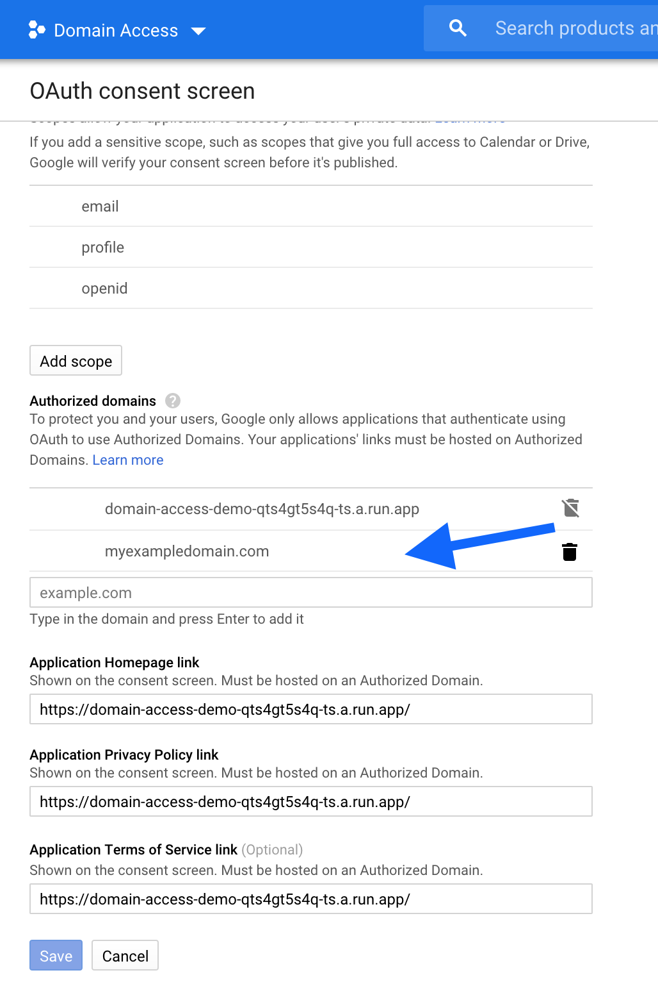
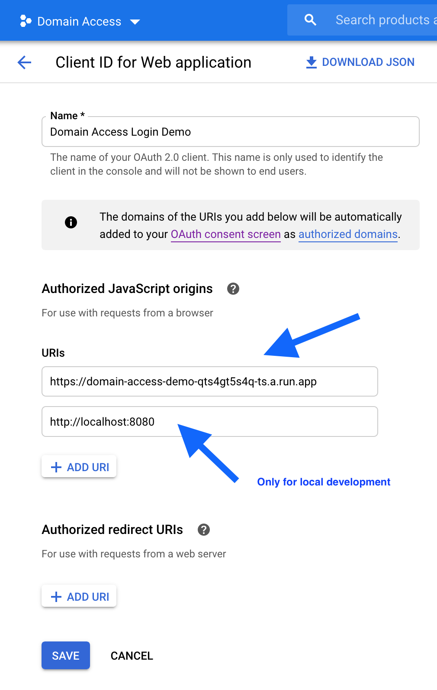

# Cloud Run Demo Login

> A simple Flask app for demoing Cloud Run login with Google.

This app is based on the [excellent instructions](https://youtu.be/1qG4BabzoXo) by Bret McGowan and Martin Omander.

## Setup

You will need to setup [OAuth2 credentials](https://console.cloud.google.com/apis/credentials) (for a web app) in Google Cloud Console.

*This will only work for an organisation account, not your personal Gmail account.*

### Step 1

Add an OAuth consent screen, adding your organisation's domain to the `Authorized Domains`:

### Step 2

Create an `OAuth2 Client ID` credential and add your app's URL to the URIs:

*TIP: Deploy this Cloud Run app first and then add the consent screen and credentials.*